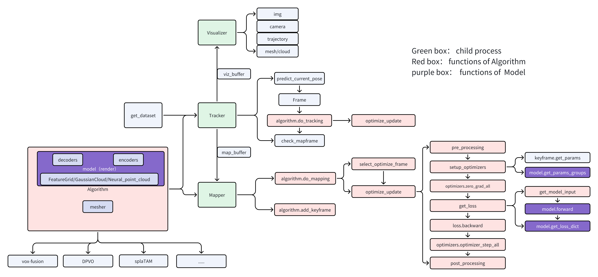

# Pipeline

The figure below is the algorithm pipeline. When adding a new **deepslam** method, you need to register the method in **input_config.py** and re-inherit and implement the functions in the **Algorithm** and **Model** classes.



# File Structure

When adding a new deep-slam method, the recommended file structure is as follows:

```
├── slam
│   ├── configs
│   │   └── input_config.py
│   ├── algorithms
│   │   ├── base_algorithm.py
│   │   ├── my_slam.py
│   ├── models
│   │   ├── base_model.py
│   │   ├── my_model.py
│   ├── model_components
│   │   ├── my_decoders.py [optional]
│   ├── ...
```

# Inherit and implement BaseAlgorithm

First create slam/algorithms/my_slam.py:

```python
"""slam/algorithms/my_slam.py"""

import functools
from dataclasses import dataclass, field
from typing import List, Type
import torch
from slam.algorithms.base_algorithm import Algorithm, AlgorithmConfig

@dataclass
class MySLAMConfig(AlgorithmConfig):
    """MyAlgorithm  Config."""
    _target: Type = field(default_factory=lambda: MySLAM)
    # method config params

class MySLAM(Algorithm):

    config: MySLAMConfig

    def __init__(self, config: MySLAMConfig, camera: Camera, device: str) -> None:
        super().__init__(config, camera, device)
        # setup model
        self.model = self.config.model.setup(camera=camera)
        self.model.to(device)

    # inherit and implement the needed functions from Algorithm
    def get_model_input(self, optimize_frames, is_mapping):
        pass
    def get_loss(self, optimize_frames, is_mapping, step=None, n_iters=None, coarse=False):
        pass
    def render_img(self, c2w, gt_depth=None, idx=None):
        return None, None
```

# Inherit and implement BaseModel

First create slam/models/my_model.py:

```python
"""slam/models/my_model.py"""

from dataclasses import dataclass, field
from typing import Dict, List, Optional, Type, Union
import torch
from torch.nn import Parameter
from slam.models.base_model import Model, ModelConfig

@dataclass
class MyModelConfig(ModelConfig):
    """Configuration for model instantiation."""
    _target: Type = field(default_factory=lambda: MyModel)
    # model config params

class MyModel(Model):
    """Model class."""

    config: MyModelConfig

    def __init__(self, config: MyModelConfig, camera: Camera, **kwargs,) -> None:
        super().__init__(config=config, camera=camera, **kwargs)

    # inherit and implement the needed functions from Model
    def populate_modules(self):
        """Set the necessary modules to get the network working."""
        super().populate_modules()
    def get_loss_dict(self, outputs, inputs, is_mapping, stage=None) -> Dict[str, torch.Tensor]:
        pass
    def get_param_groups(self) -> Dict[str, List[Parameter]]:
        pass
    def get_outputs(self, input) -> Dict[str, Union[torch.Tensor, List]]:
        pass
```

# Registering custom method with xrdslam

```python
"""slam/configs/input_config.py"""

from slam.algorithms.my_slam import MySLAMConfig
from slam.models.my_model import MyModelConfig

descriptions = {
    'MySLAM': 'Implementation of MySLAM.',
}

method_configs['my-slam'] = XRDSLAMerConfig(
    method_name='my-slam',
    xrdslam=XRDSLAMConfig(
        tracker=TrackerConfig(map_every=5,
                              render_freq=50,
                              use_relative_pose=False,
                              save_debug_result=False),
        mapper=MapperConfig(keyframe_every=50, ),
        method=MySLAMConfig(
            tracking_n_iters=10,
            mapping_n_iters=60,
            mapping_first_n_iters=1500,
            mapping_window_size=5,
            model=MyModelConfig(),
            optimizers={
                'model_params': {
                    'optimizer': AdamOptimizerConfig(),
                    'scheduler': None
                },
                'tracking_pose': {
                    'optimizer': AdamOptimizerConfig(lr=1e-3),
                    'scheduler': None,
                },
            },
        ),
        visualizer=VisualizerConfig(),
        enable_vis=False,
        device='cuda:0',
    ))
```

# Running custom method

After registering your method you should be able to run the method with,

```python
ds-run my-slam --data DATA_DIR  --data-type  replica
```
